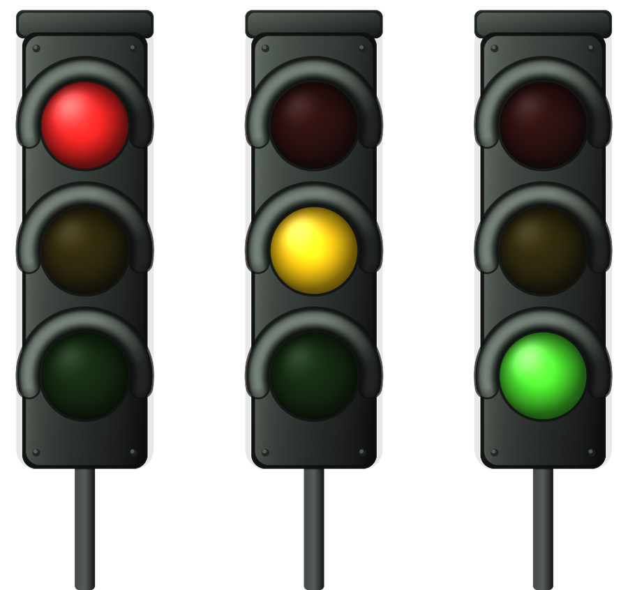

# Claude Traffic Light

A tiny traffic light that tells you what Claude is doing, so you can go do
something else while it works.

It slides in at the edge of your screen the moment you switch away from Claude,
shows the current state, and fades out on its own. It comes back whenever the
state changes.

<p align="center">
  
</p>

| Light | Meaning |
| --- | --- |
| 🔴 **Red** | Claude is waiting for you to confirm something |
| 🟡 **Yellow** | Claude is working |
| 🟢 **Green** | Done — ready for a new task |

Works with **Claude Code** (via hooks) and with **claude.ai in the browser**
(via a userscript). You can run both at once.

---

## Why

If you leave a long task running and switch to another window, you have no idea
whether Claude finished, is still thinking, or has been sitting there for ten
minutes waiting for you to approve a file write. This is a glanceable answer
that lives outside the terminal.

The idea comes from people wiring a physical traffic light to their desk. This
is the same thing without the hardware.

## Design goals

- **Native.** Plain Win32 in C. No Electron, no Python, no .NET, no runtime to
  install. One `.exe`, about 40 KB, ~3 MB of RAM.
- **Idle means idle.** No polling loop. It sleeps on system events and only
  draws while the light is on screen. (While the browser userscript is
  actively reporting, it also handles one tiny loopback request per second —
  only for as long as Claude is working.)
- **Never in your way.** The window is click-through (`WS_EX_TRANSPARENT`) and
  never takes focus, so your mouse and keyboard behave as if it weren't there.
- **Local only.** The HTTP listener binds to `127.0.0.1`, so it is reachable
  only from this machine. Requests carrying an `Origin` or `Referer` from any
  page other than `https://claude.ai` are ignored, which is what stops a
  random site from driving your light with an `` tag. Nothing is ever
  sent anywhere. The only thing it reads from your
  system is the title of the active window, to know whether you are looking
  at Claude.

---

## Install

**Requirements:** Windows 10 or 11, 64-bit.

1. Download `claude-traffic-light.exe` from
   [Releases](../../releases) (or from the `dist/` folder of this repo) and put
   it in a folder you'll keep, e.g. `C:\Tools\ClaudeTrafficLight`.
2. Drop `traffic-light.ini` next to it if you want to change the defaults.
   It's optional — without it the built-in defaults apply.
3. Double-click the `.exe`.

The light flashes once so you know it started, then hides. A coloured dot
appears in the notification area next to the clock. Right-click it for:

- **Show now**
- **Test red / yellow / green**
- **Start with Windows**
- **Exit**

> Windows SmartScreen will warn you about an unknown publisher — the binary
> isn't code-signed. Click *More info → Run anyway*, or
> [build it yourself](#building-from-source) if you'd rather not trust a
> stranger's binary.

At this point the light already reacts when you leave the Claude window. To
make it reflect Claude's actual state, connect one or both of the following.

---

## Connect it to Claude Code

Run the installer from the `claude-code` folder:

```powershell
powershell -ExecutionPolicy Bypass -File claude-code\install-hooks.ps1
```

or just double-click `claude-code\install-hooks.cmd`.

It edits `%USERPROFILE%\.claude\settings.json`, keeps a backup next to it, and
leaves any hooks you already had from other tools alone. **Open a new Claude
Code session afterwards** — hooks are read at startup.

The mapping it installs:

| Claude Code hook | State |
| --- | --- |
| `SessionStart`, `Stop` | 🟢 green |
| `UserPromptSubmit`, `PreToolUse`, `PostToolUse` | 🟡 yellow |
| `Notification` | 🔴 red |

To remove them: `install-hooks.ps1 -Remove` (or `uninstall-hooks.cmd`).
`claude-code/hooks-example.json` has the same block if you'd rather paste it by
hand.

## Connect it to claude.ai in the browser

**Option A — userscript** (runs by itself, recommended)

1. Install [Tampermonkey](https://www.tampermonkey.net/).
   On Edge you must also enable **Allow user scripts** in
   `edge://extensions/` → Tampermonkey → *Details*.
2. Tampermonkey → *Create a new script* → replace everything with the contents
   of `browser/claude-traffic-light.user.js` → save.
3. Reload claude.ai.

**Option B — bookmarklet** (nothing to install, useful on locked-down machines)

See [`browser/bookmarklet.md`](browser/bookmarklet.md). You click it once per
tab after the page loads.

Browser detection reads the page, so it's less exact than the Claude Code
hooks: yellow and green are reliable, red only shows when a permission dialog
actually appears. [How it detects browser state](#how-it-detects-browser-state)
explains what it looks at, and how to debug it if claude.ai changes.

---

## Configuration

`traffic-light.ini`, next to the executable. Restart the app after editing
(tray → Exit, then reopen).

```ini
[traffic-light]
position          = right   ; right, left, top-right, bottom-right, top-left, bottom-left
vertical_pct      = 68      ; 0 = top, 50 = centred, 100 = bottom (right/left only)
margin            = 26      ; distance from the screen edge, in pixels
size_pct          = 75      ; 100 = original size, 140 = bigger
duration_ms       = 4000    ; how long it stays before fading out
fade_in_ms        = 200
fade_out_ms       = 450
opacity           = 240     ; 0-255
show_when_focused = 0       ; 1 = show even while you're looking at Claude
show_on_blur      = 1       ; 1 = show as soon as you leave the Claude window
title_match       = claude  ; lowercase substring that identifies "the Claude window"
port              = 8787    ; local port, 127.0.0.1 only
```

`title_match` is how it recognises the Claude window: it lowercases the active
window's title and looks for this substring. That covers both a terminal
running Claude Code and a `claude.ai` browser tab. If your terminal doesn't put
"claude" in its title, point this at something that is in the title, such as
your project name.

It matches on any window, so beware the obvious false positive: an Explorer
window or an editor showing the `claude-traffic-light` folder also has
"claude" in its title, and counts as "the Claude window" while it is focused.

The size scales with your display's DPI on top of `size_pct`, so it stays the
same physical size across monitors.

`vertical_pct` exists because a vertically centred badge lands right where you
tend to be looking. The default sits it below the middle, out of the way but
still in peripheral vision. It only applies to `right` and `left`; the corner
positions place themselves.

---

## Driving it from anything else

It isn't Claude-specific. Anything that can run a command or make an HTTP
request can drive it — a build script, a test suite, a long deployment.

```bat
claude-traffic-light.exe --state waiting    :: red
claude-traffic-light.exe --state running    :: yellow
claude-traffic-light.exe --state done       :: green
claude-traffic-light.exe --show             :: show without changing state
claude-traffic-light.exe --quit             :: close it
```

```
GET http://127.0.0.1:8787/state?s=running
```

Accepted values: `waiting` / `red`, `running` / `yellow` / `busy`,
`done` / `green` / `idle`. Launching a second instance doesn't start a second
copy — it just shows the running one.

`--state` exits with 0 if it reached a running instance and 1 if there was
none, so a script can tell whether the light actually got the message.

`w` on its own, with no `s`, refreshes the watchdog without changing the
colour — that is what the browser heartbeat uses.

---

## Building from source

One file, no dependencies. There is a script for each toolchain — `./build.sh`
for MinGW-w64 and `build.cmd` for MSVC — or run the commands yourself.

With MinGW-w64 (Linux or Windows):

```sh
x86_64-w64-mingw32-gcc -O2 -municode -mwindows -o claude-traffic-light.exe \
    src/traffic-light.c -lws2_32 -lshell32 -lgdi32 -luser32 -ladvapi32 -lm -s
```

With MSVC, from a Developer Command Prompt:

```bat
cl /O2 /DUNICODE /D_UNICODE src\traffic-light.c /Fe:claude-traffic-light.exe ^
   /link /SUBSYSTEM:WINDOWS ws2_32.lib shell32.lib gdi32.lib user32.lib advapi32.lib
```

The traffic light is drawn pixel by pixel into a 32-bit premultiplied BGRA
buffer and blitted with `UpdateLayeredWindow`, so it's a real shaped, alpha
blended window — no image assets, and it stays sharp at any DPI or scale.

## How it decides what to show

- A `SetWinEventHook` on `EVENT_SYSTEM_FOREGROUND` tells the app whenever the
  active window changes. Leaving a window whose title matches `title_match`
  triggers the light.
- A second hook on `EVENT_OBJECT_NAMECHANGE` catches **tab** switches. Moving
  between tabs in one browser window is not a window change as far as Windows
  is concerned — the only thing that changes is the window's title — so
  without this, leaving the claude.ai tab for another tab went unnoticed.
- The window reclaims the top of the z-order when shown, on every frame while
  visible, and on foreground changes. It is shown at the exact moment another
  application is being activated, and that race is easy to lose. It does *not*
  use `AttachThreadInput` for this: input-queue attachment is needed to steal
  focus, not to reorder windows, and it can block clicks in the other app.
- State arrives either through `WM_COPYDATA` (the `--state` command line, used
  by the Claude Code hooks) or through the loopback HTTP listener (used by the
  browser userscript).
- A state change shows the light too, unless you're currently looking at
  Claude — configurable with `show_when_focused`.

## How it detects browser state

Claude Code reports its state directly through hooks, so that path is exact.
The browser has no such API, so the userscript infers it — and getting this
right took considerably more work than the drawing did. What it uses, in
order of confidence:

1. **The stop button.** While Claude answers, the composer's send button is
   replaced by a "Stop response" one. This is the strongest signal because it
   stays there through the silent pauses when Claude is thinking between
   steps. Matching is anchored to the start of the label and capped in length:
   a message that merely *mentions* the word "stop" ends up inside the
   "message actions" button's label, and a loose match would read that as a
   permanent stop button.
2. **The tool status pill.** Present while a tool runs, which is another
   stretch where nothing else on the page moves.
3. **A turn latch.** Once either of the above is seen, the turn is held open
   until the composer's own send button returns. Without this, every quiet gap
   read as "finished" and the light flickered yellow-green-yellow.
4. **DOM activity, as a fallback.** While an answer is being written the page
   mutates many times per second. Changes inside editable regions and buttons
   are ignored (typing a message, the send button lighting up), and a few
   batches in a row are required, so one isolated change doesn't count.

**The completion timeout lives in the desktop app, not in the browser.** While
Claude works the userscript sends `running` as a heartbeat with `&w=2500`; if
that heartbeat stops for that long, the app turns green on its own. Browsers
throttle timers in background tabs — sometimes to once a minute — which is
exactly when the light matters, so the countdown cannot live there.

### Debugging it

If claude.ai changes and the light stops tracking, the userscript publishes its
state as an attribute on `<html>`. In the browser console on claude.ai:

```js
document.documentElement.dataset.semaforo
```

It returns what the script currently thinks: what it is reporting, whether it
found the stop button and which label matched, whether a turn is open, and the
last element that changed. It is written to the DOM rather than exposed as a
function because userscripts run in an isolated world — in Edge, even
`unsafeWindow` doesn't bridge it.

To find the current name of the stop button, snapshot the buttons while idle
and diff them against the buttons present while Claude works:

```js
window.__base=new Set([...document.querySelectorAll('button')].map(b=>(b.getAttribute('aria-label')||'')+' | '+(b.getAttribute('data-testid')||'')));
window.__new=new Set();
setInterval(()=>{for(const b of document.querySelectorAll('button')){const k=(b.getAttribute('aria-label')||'')+' | '+(b.getAttribute('data-testid')||'');if(!__base.has(k))__new.add(k)}},300);
// ask Claude something long, then:
[...__new]
```

## Spanish names still work

The tool started out in Spanish and those names are still accepted, so an
older setup keeps working after an upgrade:

| English | Spanish alias |
| --- | --- |
| `traffic-light.ini` | `semaforo.ini` (used if the first one is absent) |
| `[traffic-light]` | `[semaforo]` |
| `position`, `vertical_pct`, `margin`, `size_pct` | `posicion`, `altura_pct`, `margen`, `tamano_pct` |
| `duration_ms`, `opacity`, `port`, `title_match` | `duracion_ms`, `opacidad`, `puerto`, `titulo` |
| `show_when_focused`, `show_on_blur` | `mostrar_con_foco`, `mostrar_al_salir` |
| `--state`, `--show`, `--quit` | `--estado`, `--mostrar`, `--salir` |

State names accept `rojo` / `amarillo` / `verde` as well.

## Known limitations

- Windows only. The drawing and the window handling are pure Win32.
- Browser state is inferred from the page, so a claude.ai redesign can break
  it. The signals are listed above and the matching rules sit at the top of the
  userscript; the debugging recipe finds the new names in one pass.
- The binary is unsigned, so expect a SmartScreen prompt on first run.
- If port 8787 is already taken, the browser side cannot reach the app. It
  says so in a notification and in the tray tooltip; change `port` in the ini
  and the matching `PORT` in the userscript.
- With two claude.ai tabs open the userscript coordinates them so an idle tab
  doesn't cut the working one short. The bookmarklet has no such coordination.

## License

MIT — see [LICENSE](LICENSE).
